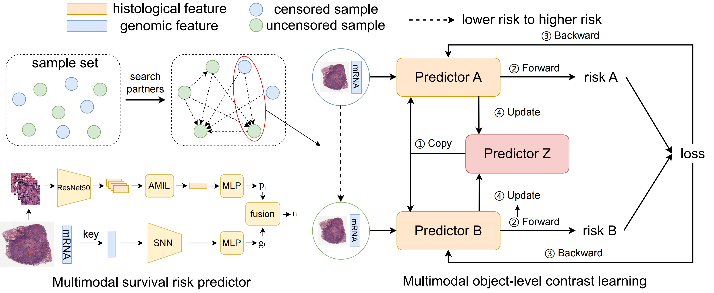

# A Multimodal Object-level Contrast Learning Method for Cancer Survival Risk Prediction

This repository is the official implementation of A Multimodal Object-level Contrast Learning Method for Cancer Survival Risk Prediction



## 🚀 1. Requirements

To install requirements:

```bash
pip install -r requirements.txt
```

## 🚀 2. Download Data and Pretrained Models

1. **Downloading TCGA Data**

   All of our mutimodal data are download from public dataset repository [TCGA](https://portal.gdc.cancer.gov/repository).
2. **Preprocessing Whole Slide Images**

   We use the publicaly available WSIs-analysis toolbox [CLAM](https://github.com/mahmoodlab/CLAM.) to preprocess WSIs. All WSIs are tiled to nonoverlapping 256x256 patches at the 20x magnification and  the patches with large background area are deleted. Then a pretrained truncated ResNet50 is used to encode raw image patches into 1024-dim feature vector.

   Folder structure:

   ```
   .
   ├── LUAD
   │   └── features
   │       ├── pt_files
   |			├── slide1.pt
   |	 		├── slide2.pt
   │           ├── ...
   │       └── h5_files
   |			├── slide1.h5
   |	 		├── slide2.h5
   │           ├── ...
   ├── KIRC
   │   └── features
   │       ├── pt_files
   |			├── slide1.pt
   |	 		├── slide2.pt
   │           ├── ...
   │       └── h5_files
   |			├── slide1.h5
   |	 		├── slide2.h5
   │           ├── ...
   ├── ...
   ```
3. **Preprocessing RNA-Seq Data**

   We collate the patients' RNA-Seq data downloaded from the website into expression matrix and screen out cancer-related genes.

   Folder structure:

   ```bash
   .
   ├── LUAD
   │   ├── 5fold-rna
   │   │   ├── splits_0.csv
   │   │   ├── splits_1.csv
   │   │   ├── ...
   │   ├── raw_data
   │   │   ├── clinical.csv
   │   │   └── rnaseq.csv
   │   └── wsi_rna_ids.csv
   ├── KIRC
   │   ├── 5fold-rna
   │   │   ├── splits_0.csv
   │   │   ├── splits_1.csv
   │   │   ├── ...
   │   ├── raw_data
   │   │   ├── clinical.csv
   │   │   ├── rnaseq.csv
   │   │   └── wsi_rnaseq.txt
   │   └── wsi_rna_ids.csv
   ├── ...
   ├── mrna.csv
   └── signatures.csv
   ```

## 🚀 3. Training

\<cancer type\> can be LUAD or KIRC

**SNN**

```bash
CUDA_VISIBLE_DEVICES=0 python train.py\
    --dataset_dir <path to datasets dir>\
    --results_dir <path to results dir>\
    --study <cancer type>\
    --data_mode omic\
    --model_type snn\
    --model_size_omic small\
    --target_gene signatures_rnaseq\
    --reg_type omic\
    --bag_loss contrast\
    --gc 128\
    --lr 0.0002\
    --n_classes 1 
```

**AMIL**

```bash
CUDA_VISIBLE_DEVICES=0 python train.py\
    --data_dir <path to WSI features dir>\
    --dataset_dir <path to datasets dir>\
    --results_dir <path to results dir>\
    --study <cancer type>\
    --data_mode path\
    --model_type amil\
    --bag_loss contrast\
    --gc 128\
    --lr 0.0002\
    --n_classes 1
```

## 🚀 4. Evaluation

**SNN**

```bash
CUDA_VISIBLE_DEVICES=0 python eval.py\
    --weights <path to model weights>\
    --fold <fold number to eval>\
    --save_dir <dir path to save results>\
    --dataset_dir <path to datasets dir>\
    --study <cancer type>\
    --data_mode omic\
    --model_type snn\
    --model_size_omic small\
    --target_gene signatures_rnaseq\
    --n_classes 1
```

**AMIL**

```bash
CUDA_VISIBLE_DEVICES=0 python eval.py\
 	--weights <path to model weights>\
    --fold <fold number to eval>\
    --save_dir <dir path to save results>\
    --data_dir <path to WSI features dir>\
    --dataset_dir <path to datasets dir>\
    --study <cancer type>\
    --data_mode path\
    --model_type amil\
    --n_classes 1
```

**late fusion**

```
python late_fusion.py\
    --wsi_dir <dir to wsi results>\
    --rna_dir <dir to genomic results>\
    --muti_dir <dir to mutimodal output>
```

## 🚀 5. Visualization

We also provide our visualizetion code to explain models.


```
python draw_heatmap.py\
    --id <wsi id>\
    --weights <wsi model weights>\
    --wsi_dir <wsi raw data dir>\
    --h5_dir <wsi h5 files dir>
```
